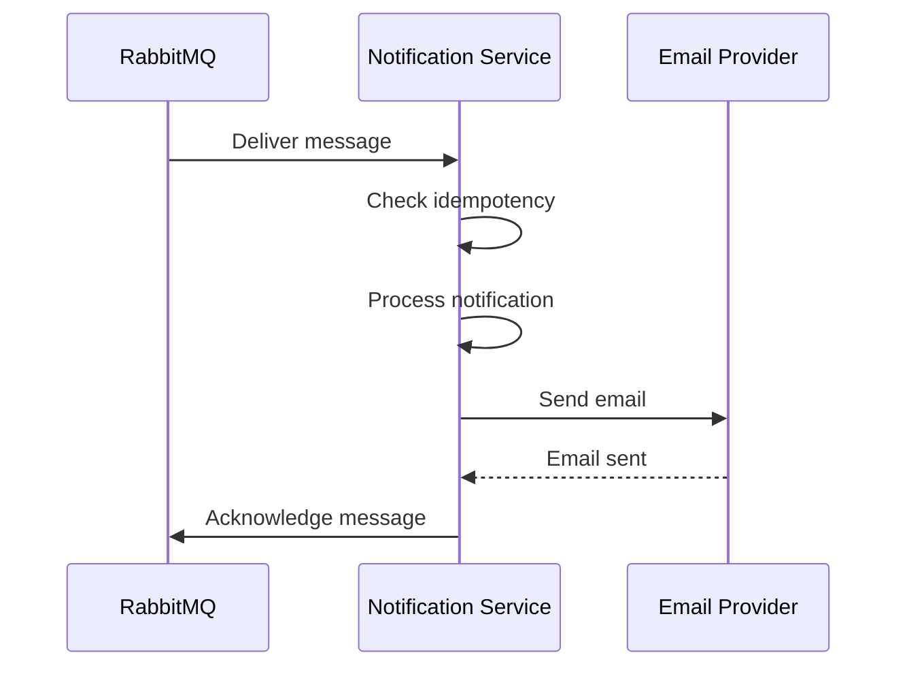
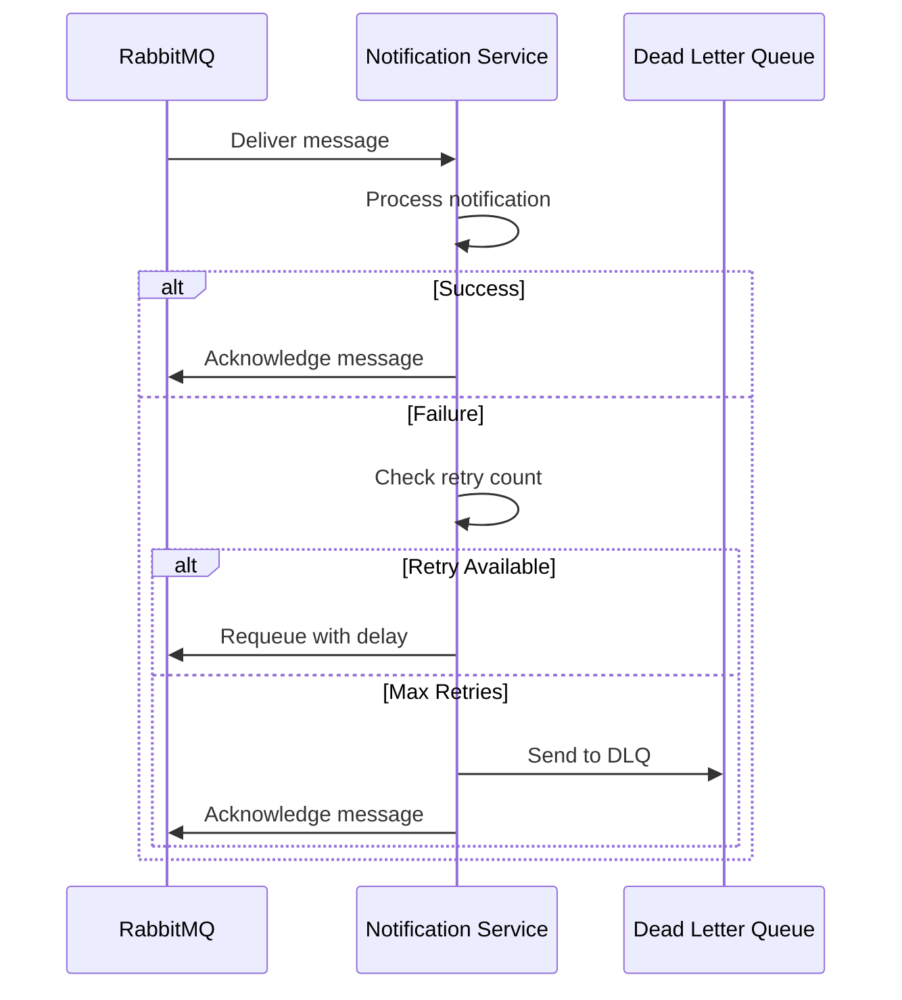

# 📧 Notification Service

## Overview

The Notification Service handles email notifications and alerts in the microservices architecture. It consumes messages from RabbitMQ queues, processes notification requests, and sends emails using professional HTML templates. The service includes advanced features like idempotency, retry mechanisms, and dead letter queue support.

## 🏗️ Architecture

```
┌─────────────────┐    RabbitMQ    ┌──────────────────┐    SMTP     ┌──────────────────┐
│ Messaging       │ ──────────────→ │ Notification     │ ──────────→ │ Email            │
│ Service         │                 │ Service          │             │ Provider         │
│ (Port 3006)     │                 │ (Port 3003)      │             │ (Gmail/SMTP)     │
└─────────────────┘                 └──────────────────┘             └──────────────────┘
```

## 🚀 Features

### Core Notification
- **Email Sending**: Professional HTML email templates
- **Message Consumption**: RabbitMQ message consumption
- **Template System**: Multiple email templates (welcome, password reset, todo reminders)
- **Idempotency**: Prevents duplicate message processing
- **Retry Mechanism**: Exponential backoff with jitter

### Advanced Features
- **Dead Letter Queue**: Handles failed messages
- **Message Persistence**: Durable message processing
- **Health Monitoring**: Service and queue health checks
- **Structured Logging**: Comprehensive notification operation logging
- **Graceful Shutdown**: Proper cleanup and connection management

## 📋 API Endpoints

### Direct Notification (Testing)
```http
POST /api/notifications/send    # Send notification directly
```

### Monitoring & Management
```http
GET  /api/health               # Service health check
GET  /api/queue/status         # Queue status and metrics
```

## 🔑 Notification Flow

### 1. Message Consumption


### 2. Error Handling


## 🛡️ Security Features

### Message Security
- **Message Validation**: Validates message structure and content
- **Idempotency**: Prevents duplicate message processing
- **Error Handling**: Secure error message handling
- **Data Sanitization**: Sanitizes email content

### Email Security
- **SMTP Security**: Secure SMTP connections
- **Content Validation**: Validates email content
- **Template Security**: Secure HTML template rendering
- **Rate Limiting**: Prevents email abuse

## 📊 API Examples

### Send Direct Notification (Testing)
```bash
curl -X POST http://localhost:3003/api/notifications/send \
  -H "Content-Type: application/json" \
  -d '{
    "type": "welcome",
    "recipient": "user@example.com",
    "subject": "Welcome to Our Platform!",
    "content": {
      "name": "John Doe",
      "message": "Thank you for joining our platform!"
    },
    "template": "welcome"
  }'
```

Response:
```json
{
  "message": "Notification sent successfully"
}
```

### Health Check
```bash
curl http://localhost:3003/api/health
```

Response:
```json
{
  "status": "healthy",
  "service": "notification-service",
  "rabbitmq": "connected",
  "timestamp": "2024-01-15T10:30:00.000Z"
}
```

### Queue Status
```bash
curl http://localhost:3003/api/queue/status
```

Response:
```json
{
  "status": "connected",
  "queue": "notification_queue",
  "connection": "active",
  "role": "consumer"
}
```

## 🔧 Configuration

### Environment Variables
```bash
# Email Configuration
EMAIL_SERVICE=gmail
EMAIL_USER=your-email@gmail.com
EMAIL_PASS=your-app-password

# RabbitMQ Configuration
RABBITMQ_URL=amqp://localhost
NOTIFICATION_SERVICE_PORT=3003

# Service Configuration
NODE_ENV=development
```

### Email Configuration
```javascript
const createTransporter = () => {
  return nodemailer.createTransporter({
    service: process.env.EMAIL_SERVICE || 'gmail',
    auth: {
      user: process.env.EMAIL_USER,
      pass: process.env.EMAIL_PASS
    }
  });
};
```

## 🗄️ Queue Configuration

### Message Consumption
```javascript
channel.consume(QUEUE_NAME, async (msg) => {
  if (msg) {
    const messageId = msg.properties.messageId || 'unknown';
    const retryCount = msg.properties.headers?.retryCount || 0;
    const maxRetries = 3;
    
    try {
      const notificationData = JSON.parse(msg.content.toString());
      
      // Check idempotency
      if (processedMessages.has(messageId)) {
        logger.duplicateMessage(messageId, notificationData.type, notificationData.recipient);
        channel.ack(msg);
        return;
      }
      
      // Send notification
      await sendNotification(notificationData);
      
      // Mark as processed
      processedMessages.add(messageId);
      channel.ack(msg);
    } catch (error) {
      // Handle errors with retry logic
    }
  }
});
```

## 📧 Email Templates

### Welcome Template
```html
<!DOCTYPE html>
<html>
<head>
  <style>
    body { font-family: Arial, sans-serif; line-height: 1.6; color: #333; }
    .container { max-width: 600px; margin: 0 auto; padding: 20px; }
    .header { background: #007bff; color: white; padding: 20px; text-align: center; }
    .content { padding: 20px; background: #f9f9f9; }
    .footer { text-align: center; padding: 20px; color: #666; }
  </style>
</head>
<body>
  <div class="container">
    <div class="header">
      <h1>Welcome to Our Service!</h1>
    </div>
    <div class="content">
      <p>Hello ${content.name || 'there'}!</p>
      <p>${content.message || 'Welcome to our platform. We\'re excited to have you on board!'}</p>
    </div>
    <div class="footer">
      <p>Thank you for choosing us!</p>
    </div>
  </div>
</body>
</html>
```

### Password Reset Template
```html
<!DOCTYPE html>
<html>
<head>
  <style>
    body { font-family: Arial, sans-serif; line-height: 1.6; color: #333; }
    .container { max-width: 600px; margin: 0 auto; padding: 20px; }
    .header { background: #dc3545; color: white; padding: 20px; text-align: center; }
    .content { padding: 20px; background: #f9f9f9; }
    .button { display: inline-block; padding: 10px 20px; background: #007bff; color: white; text-decoration: none; border-radius: 5px; }
    .footer { text-align: center; padding: 20px; color: #666; }
  </style>
</head>
<body>
  <div class="container">
    <div class="header">
      <h1>Password Reset Request</h1>
    </div>
    <div class="content">
      <p>Hello ${content.name || 'there'}!</p>
      <p>You requested a password reset. Click the button below to reset your password:</p>
      <p style="text-align: center;">
        <a href="${content.resetLink}" class="button">Reset Password</a>
      </p>
      <p>If you didn't request this, please ignore this email.</p>
    </div>
    <div class="footer">
      <p>This link will expire in 1 hour.</p>
    </div>
  </div>
</body>
</html>
```

### Todo Reminder Template
```html
<!DOCTYPE html>
<html>
<head>
  <style>
    body { font-family: Arial, sans-serif; line-height: 1.6; color: #333; }
    .container { max-width: 600px; margin: 0 auto; padding: 20px; }
    .header { background: #ffc107; color: #333; padding: 20px; text-align: center; }
    .content { padding: 20px; background: #f9f9f9; }
    .todo-item { background: white; padding: 15px; margin: 10px 0; border-left: 4px solid #ffc107; }
    .footer { text-align: center; padding: 20px; color: #666; }
  </style>
</head>
<body>
  <div class="container">
    <div class="header">
      <h1>Todo Reminder</h1>
    </div>
    <div class="content">
      <p>Hello ${content.name || 'there'}!</p>
      <p>You have the following todo items due soon:</p>
      ${content.todos ? content.todos.map(todo => `
        <div class="todo-item">
          <h3>${todo.title}</h3>
          <p>${todo.description || 'No description'}</p>
          <p><strong>Due:</strong> ${todo.dueDate}</p>
        </div>
      `).join('') : '<p>No specific todos to display.</p>'}
    </div>
    <div class="footer">
      <p>Don't forget to check your todo list!</p>
    </div>
  </div>
</body>
</html>
```

## 🔄 Integration with Other Services

### Messaging Service Integration
- **Message Consumption**: Consumes messages from RabbitMQ queues
- **Queue Management**: Manages queue connections and health
- **Error Handling**: Handles failed message processing

### User Service Integration
- **Welcome Notifications**: Sends welcome emails on user creation
- **User Operations**: Notifications for user-related operations
- **User Context**: Includes user information in notifications

### Todo Service Integration
- **Todo Notifications**: Sends notifications for todo operations
- **Todo Operations**: Creation, update, and deletion notifications
- **Todo Context**: Includes todo information in notifications

## 📝 Logging

### Structured Logging
The service uses the centralized logger for consistent logging:

```javascript
// Message operations
logger.messageReceived(messageId, notificationData.type, notificationData.recipient, retryCount);
logger.messageProcessed(messageId, notificationData.recipient);
logger.duplicateMessage(messageId, notificationData.type, notificationData.recipient);

// Email operations
logger.emailSent(recipient, subject, template);
logger.emailFailed(recipient, error);

// Error logging
logger.error('Notification processing failed', {
  messageId,
  error: error.message,
  retryCount
});
```

### Log Levels
- **INFO**: Normal operations, message processing
- **SUCCESS**: Successful email operations
- **WARN**: Duplicate messages, retry attempts
- **ERROR**: System errors, email failures

## 🚀 Getting Started

### 1. Installation
```bash
cd notification-service
npm install
```

### 2. Email Setup
```bash
# Gmail Setup
# 1. Enable 2-factor authentication
# 2. Generate app password
# 3. Update EMAIL_USER and EMAIL_PASS in .env

# Or use other SMTP providers
# Update EMAIL_SERVICE and SMTP settings
```

### 3. Environment Setup
```bash
# Create .env file
cp .env.example .env
# Edit .env with your email configuration
```

### 4. Start the Service
```bash
npm start
```

### 5. Verify Installation
```bash
# Check service health
curl http://localhost:3003/api/health

# Test direct notification
curl -X POST http://localhost:3003/api/notifications/send \
  -H "Content-Type: application/json" \
  -d '{"type":"welcome","recipient":"test@example.com","subject":"Test","content":{"name":"Test User"}}'
```

## 🔍 Health Monitoring

### Health Check Endpoint
```bash
curl http://localhost:3003/api/health
```

Response:
```json
{
  "status": "healthy",
  "service": "notification-service",
  "rabbitmq": "connected",
  "timestamp": "2024-01-15T10:30:00.000Z"
}
```

### Health Status
- **Service Status**: Overall service health
- **RabbitMQ Status**: RabbitMQ connection status
- **Queue Status**: Queue health and metrics
- **Email Status**: Email service status

## 🛠️ Message Processing

### Message Consumption
```javascript
const consumeMessages = async () => {
  try {
    logger.info('Starting message consumption', { queue: QUEUE_NAME });
    
    channel.consume(QUEUE_NAME, async (msg) => {
      if (msg) {
        const messageId = msg.properties.messageId || 'unknown';
        const retryCount = msg.properties.headers?.retryCount || 0;
        const maxRetries = 3;
        
        try {
          const notificationData = JSON.parse(msg.content.toString());
          
          // Check idempotency
          if (processedMessages.has(messageId)) {
            logger.duplicateMessage(messageId, notificationData.type, notificationData.recipient);
            channel.ack(msg);
            return;
          }
          
          logger.messageReceived(messageId, notificationData.type, notificationData.recipient, retryCount);
          
          // Send notification
          await sendNotification(notificationData);
          
          // Mark as processed
          processedMessages.add(messageId);
          channel.ack(msg);
          logger.messageProcessed(messageId, notificationData.recipient);
        } catch (error) {
          // Handle errors with retry logic
        }
      }
    });
  } catch (error) {
    logger.error('Message consumption error', { error: error.message });
  }
};
```

### Retry Mechanism
```javascript
const calculateBackoffDelay = (retryCount) => {
  const baseDelay = 1000; // 1 second
  const maxDelay = 30000; // 30 seconds
  const delay = Math.min(baseDelay * Math.pow(2, retryCount), maxDelay);
  return delay + Math.random() * 1000; // Add jitter
};
```

## 🔐 Security Best Practices

### Email Security
- **SMTP Security**: Use secure SMTP connections
- **Content Validation**: Validate email content
- **Template Security**: Secure HTML template rendering
- **Rate Limiting**: Prevent email abuse

### Message Security
- **Message Validation**: Validate message structure
- **Idempotency**: Prevent duplicate processing
- **Error Handling**: Secure error handling
- **Data Sanitization**: Sanitize email content

## 🚨 Error Handling

### Notification Errors
- **400 Bad Request**: Missing required fields
- **500 Internal Server Error**: Email sending failures
- **503 Service Unavailable**: RabbitMQ unavailable

### Error Responses
```json
{
  "error": "Recipient and type are required for notifications"
}
```

## 📚 Dependencies

### Core Dependencies
- **express**: Web framework
- **nodemailer**: Email sending
- **amqplib**: RabbitMQ client
- **cors**: Cross-origin resource sharing
- **dotenv**: Environment variable management

### Logger Integration
- **../logger-service/logger.js**: Centralized logging

## 🔧 Customization

### Adding New Templates
```javascript
const generateCustomTemplate = (content) => {
  return `
    <!DOCTYPE html>
    <html>
    <head>
      <style>
        /* Custom styles */
      </style>
    </head>
    <body>
      <div class="container">
        <div class="header">
          <h1>Custom Template</h1>
        </div>
        <div class="content">
          <p>${content.message}</p>
        </div>
      </div>
    </body>
    </html>
  `;
};
```

### Custom Notification Types
```javascript
const sendNotification = async (data) => {
  const { type, recipient, subject, content, template } = data;
  
  switch (type) {
    case 'email':
      await sendEmail(recipient, subject, content, template);
      break;
    case 'welcome':
      await sendEmail(recipient, 'Welcome to Our Platform!', content, 'welcome');
      break;
    case 'password_reset':
      await sendEmail(recipient, 'Password Reset Request', content, 'password_reset');
      break;
    case 'todo_reminder':
      await sendEmail(recipient, 'Todo Reminder', content, 'todo_reminder');
      break;
    case 'custom_type':
      await sendEmail(recipient, subject, content, 'custom');
      break;
    default:
      await sendEmail(recipient, subject, content, template);
  }
};
```

## 🚨 Production Considerations

### Email
- **SMTP Configuration**: Use production SMTP settings
- **Rate Limiting**: Implement email rate limiting
- **Monitoring**: Monitor email delivery rates
- **Backup**: Implement email backup strategies

### Security
- **HTTPS**: Enable SSL/TLS encryption
- **Authentication**: Implement proper authentication
- **Content Security**: Secure email content
- **Access Control**: Implement proper access controls

### Performance
- **Connection Pooling**: Optimize SMTP connections
- **Load Balancing**: Use multiple service instances
- **Queue Optimization**: Optimize queue configurations
- **Monitoring**: Monitor service performance

---

**The Notification Service provides reliable email notifications with professional templates and robust error handling in your microservices architecture!** 📧
