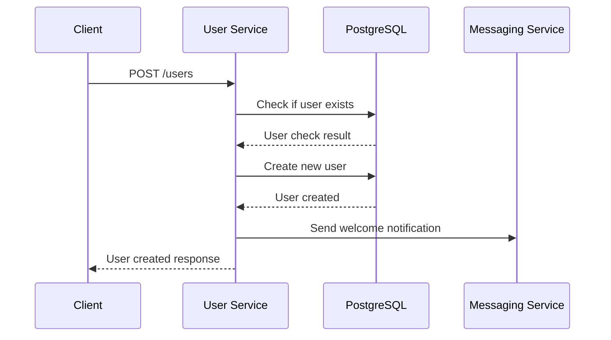
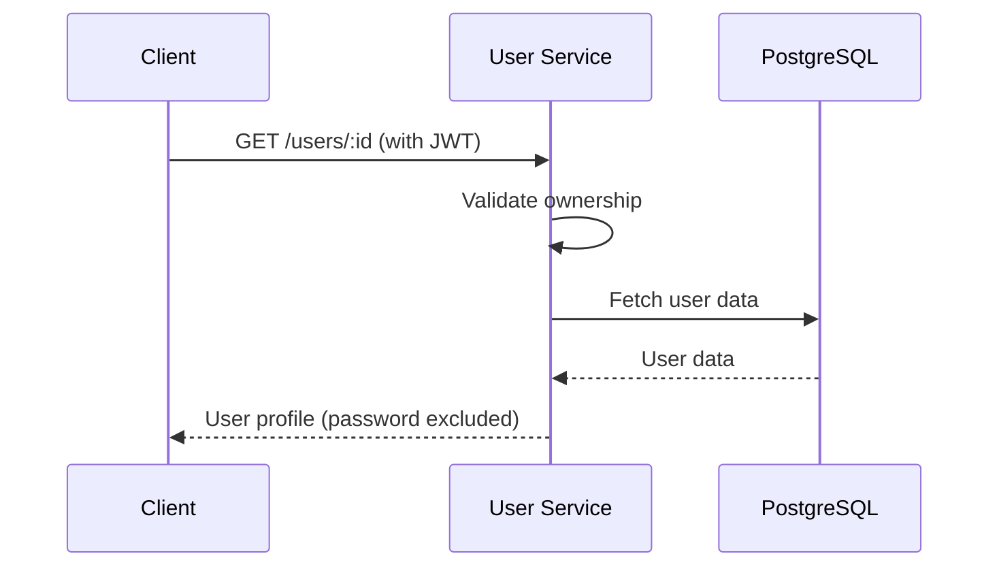

# 👤 User Service

## Overview

The User Service manages user data and profiles in the microservices architecture. It provides comprehensive user management capabilities including CRUD operations, authentication integration, and notification support. The service uses PostgreSQL for data persistence and integrates with the messaging service for user-related notifications.

## 🏗️ Architecture

```
┌─────────────────┐    ┌─────────────────┐    ┌─────────────────┐
│   API Gateway   │───►│  User Service   │───►│   PostgreSQL    │
│   (Port 3000)   │    │   (Port 3001)   │    │   Database      │
└─────────────────┘    └─────────────────┘    └─────────────────┘
         │                       │                       │
         │                       ▼                       │
         │              ┌─────────────────┐              │
         └─────────────►│ Messaging       │◄─────────────┘
                        │ Service         │
                        │ (Port 3006)     │
                        └─────────────────┘
```

## 🚀 Features

### Core User Management
- **User CRUD Operations**: Create, read, update, delete users
- **Profile Management**: User profile information management
- **Authentication Integration**: Seamless integration with auth service
- **Role-Based Access**: Admin and user role management
- **Ownership Validation**: Users can only access their own data

### Advanced Features
- **Welcome Notifications**: Automatic welcome emails on user creation
- **Messaging Integration**: Sends notifications via messaging service
- **Structured Logging**: Comprehensive user operation logging
- **Health Monitoring**: Service health and database status monitoring
- **Graceful Shutdown**: Proper cleanup and connection management

## 📋 API Endpoints

### Public Endpoints
```http
POST /users              # Create new user (public registration)
GET  /health            # Service health check
```

### Protected Endpoints
```http
GET    /users           # List all users (Admin only)
GET    /users/:id       # Get user by ID (Own or Admin)
PUT    /users/:id       # Update user (Own or Admin)
DELETE /users/:id       # Delete user (Own or Admin)
GET    /users/email/:email # Get user by email (Internal use)
```

## 🔑 User Management Flow

### 1. User Creation


### 2. User Profile Access


## 🛡️ Security Features

### Authentication Integration
- **JWT Validation**: Validates JWT tokens from auth service
- **User Context**: Extracts user information from JWT payload
- **Ownership Validation**: Ensures users can only access their own data
- **Role-Based Access**: Admin users have elevated privileges

### Data Security
- **Password Protection**: Passwords are hashed and never returned in responses
- **Input Validation**: Validates all input data
- **SQL Injection Protection**: Uses TypeORM for safe database queries
- **Data Sanitization**: Removes sensitive data from responses

## 📊 API Examples

### Create User (Public)
```bash
curl -X POST http://localhost:3001/users \
  -H "Content-Type: application/json" \
  -d '{
    "name": "John Doe",
    "email": "john@example.com",
    "password": "securepassword123"
  }'
```

Response:
```json
{
  "id": 1,
  "name": "John Doe",
  "email": "john@example.com",
  "role": "user",
  "createdAt": "2024-01-15T10:30:00.000Z",
  "updatedAt": "2024-01-15T10:30:00.000Z"
}
```

### Get User Profile (Authenticated)
```bash
curl -X GET http://localhost:3001/users/1 \
  -H "Authorization: Bearer <JWT_TOKEN>"
```

Response:
```json
{
  "id": 1,
  "name": "John Doe",
  "email": "john@example.com",
  "role": "user",
  "createdAt": "2024-01-15T10:30:00.000Z",
  "updatedAt": "2024-01-15T10:30:00.000Z"
}
```

### Update User (Own or Admin)
```bash
curl -X PUT http://localhost:3001/users/1 \
  -H "Authorization: Bearer <JWT_TOKEN>" \
  -H "Content-Type: application/json" \
  -d '{
    "name": "John Smith",
    "email": "johnsmith@example.com"
  }'
```

Response:
```json
{
  "id": 1,
  "name": "John Smith",
  "email": "johnsmith@example.com",
  "role": "user",
  "createdAt": "2024-01-15T10:30:00.000Z",
  "updatedAt": "2024-01-15T10:30:00.000Z"
}
```

### List All Users (Admin Only)
```bash
curl -X GET http://localhost:3001/users \
  -H "Authorization: Bearer <ADMIN_JWT_TOKEN>"
```

Response:
```json
[
  {
    "id": 1,
    "name": "John Doe",
    "email": "john@example.com",
    "role": "user",
    "createdAt": "2024-01-15T10:30:00.000Z",
    "updatedAt": "2024-01-15T10:30:00.000Z"
  },
  {
    "id": 2,
    "name": "Jane Smith",
    "email": "jane@example.com",
    "role": "admin",
    "createdAt": "2024-01-15T10:30:00.000Z",
    "updatedAt": "2024-01-15T10:30:00.000Z"
  }
]
```

## 🔧 Configuration

### Environment Variables
```bash
# Database Configuration
DB_HOST=localhost
DB_PORT=5432
DB_USERNAME=postgres
DB_PASSWORD=your_password
DB_NAME=users_db

# Service URLs
MESSAGING_SERVICE_URL=http://localhost:3006

# Service Configuration
PORT=3001
NODE_ENV=development
```

### Database Configuration
```javascript
export const AppDataSource = new DataSource({
  type: "postgres",
  host: process.env.DB_HOST || "localhost",
  port: parseInt(process.env.DB_PORT) || 5432,
  username: process.env.DB_USERNAME || "postgres",
  password: process.env.DB_PASSWORD,
  database: process.env.DB_NAME || "users_db",
  entities: [User],
  synchronize: true,
  logging: false
});
```

## 🗄️ Database Schema

### User Entity
```typescript
@Entity("users")
export class User {
  @PrimaryGeneratedColumn()
  id: number;

  @Column({ length: 100 })
  name: string;

  @Column({ unique: true, length: 255 })
  email: string;

  @Column({ length: 255 })
  password: string;

  @Column({ default: "user" })
  role: string;

  @CreateDateColumn()
  createdAt: Date;

  @UpdateDateColumn()
  updatedAt: Date;
}
```

## 🔄 Integration with Other Services

### Authentication Service Integration
- **User Validation**: Validates user credentials for authentication
- **User Data**: Provides user information for JWT payload
- **User Creation**: Creates users during registration process

### Messaging Service Integration
- **Welcome Notifications**: Sends welcome emails on user creation
- **Notification Data**: Includes user context and creation information
- **Async Processing**: Non-blocking notification sending

### API Gateway Integration
- **Request Routing**: Receives requests through API Gateway
- **Authentication**: Validates JWT tokens from requests
- **Response Formatting**: Returns consistent response format

## 📝 Logging

### Structured Logging
The service uses the centralized logger for consistent logging:

```javascript
// User operations
logger.userCreated(savedUser.id, email, 'user');
logger.userUpdated(userId, email);
logger.userDeleted(userId, user.email);

// API operations
logger.info('Fetching all users - Admin request', { 
  adminId: req.user?.userId,
  adminEmail: req.user?.email 
});

// Error logging
logger.error('Error fetching users', { 
  adminId: req.user?.userId,
  error: error.message 
});
```

### Log Levels
- **INFO**: Normal operations, user requests
- **SUCCESS**: Successful user operations
- **WARN**: User not found, validation errors
- **ERROR**: System errors, database failures

## 🚀 Getting Started

### 1. Installation
```bash
cd user-service
npm install
```

### 2. Database Setup
```bash
# Install PostgreSQL
# Create database
createdb users_db

# Or use Docker
docker run --name postgres-users \
  -e POSTGRES_PASSWORD=postgres \
  -e POSTGRES_DB=users_db \
  -p 5432:5432 -d postgres
```

### 3. Environment Setup
```bash
# Create .env file
cp .env.example .env
# Edit .env with your database configuration
```

### 4. Start the Service
```bash
npm start
```

### 5. Verify Installation
```bash
# Check service health
curl http://localhost:3001/health

# Test user creation
curl -X POST http://localhost:3001/users \
  -H "Content-Type: application/json" \
  -d '{"name":"Test User","email":"test@example.com","password":"password123"}'
```

## 🔍 Health Monitoring

### Health Check Endpoint
```bash
curl http://localhost:3001/health
```

Response:
```json
{
  "status": "OK",
  "database": "PostgreSQL",
  "connection": "Connected",
  "userCount": 5,
  "messagingService": "healthy",
  "timestamp": "2024-01-15T10:30:00.000Z"
}
```

### Health Status
- **Database Status**: PostgreSQL connection status
- **User Count**: Total number of users in database
- **Messaging Service**: Status of messaging service integration
- **Service Health**: Overall service health status

## 🛠️ Middleware Usage

### Authentication Middleware
```javascript
import { authenticateToken, requireRole, requireUserOwnership } from '../auth-service/auth-middleware.js';

// Admin-only endpoint
app.get('/users', authenticateToken, requireRole('admin'), async (req, res) => {
  // Admin can access all users
});

// User ownership validation
app.get('/users/:id', authenticateToken, requireUserOwnership, async (req, res) => {
  // User can only access their own profile
});
```

### Custom Ownership Middleware
```javascript
const requireUserOwnership = async (req, res, next) => {
  try {
    const userId = req.params.id;
    
    // Check if user is accessing their own profile or is admin
    if (req.user.role === 'admin' || parseInt(req.user.userId) === parseInt(userId)) {
      next();
    } else {
      return res.status(403).json({ 
        error: 'Access denied. You can only access your own profile.' 
      });
    }
  } catch (error) {
    logger.error('User ownership check error', { error: error.message });
    return res.status(500).json({ error: 'Internal server error' });
  }
};
```

## 🔐 Security Best Practices

### Data Protection
- **Password Hashing**: Use bcrypt for password hashing
- **Input Validation**: Validate all input data
- **SQL Injection**: Use parameterized queries
- **Data Sanitization**: Remove sensitive data from responses

### Access Control
- **Authentication**: Require JWT tokens for protected endpoints
- **Authorization**: Implement role-based access control
- **Ownership**: Ensure users can only access their own data
- **Admin Privileges**: Admin users have elevated access

### General Security
- **HTTPS**: Use HTTPS in production
- **Rate Limiting**: Implement rate limiting for user operations
- **Input Sanitization**: Sanitize all user input
- **Error Handling**: Don't expose sensitive information in errors

## 🚨 Error Handling

### User Errors
- **400 Bad Request**: Missing required fields
- **403 Forbidden**: Insufficient permissions
- **404 Not Found**: User not found
- **409 Conflict**: User with email already exists
- **500 Internal Server Error**: System errors

### Error Responses
```json
{
  "error": "User with this email already exists"
}
```

## 📚 Dependencies

### Core Dependencies
- **express**: Web framework
- **typeorm**: Object-relational mapping
- **pg**: PostgreSQL driver
- **axios**: HTTP client for service communication
- **cors**: Cross-origin resource sharing
- **dotenv**: Environment variable management

### Logger Integration
- **../logger-service/logger.js**: Centralized logging

## 🔧 Customization

### Adding New User Fields
```typescript
@Entity("users")
export class User {
  // ... existing fields
  
  @Column({ nullable: true })
  phone: string;

  @Column({ nullable: true })
  avatar: string;

  @Column({ default: true })
  isActive: boolean;
}
```

### Custom User Operations
```javascript
// Add user search endpoint
app.get('/users/search', authenticateToken, async (req, res) => {
  const { query } = req.query;
  const users = await userRepository.find({
    where: [
      { name: Like(`%${query}%`) },
      { email: Like(`%${query}%`) }
    ]
  });
  res.json(users);
});
```

## 🚨 Production Considerations

### Database
- **Connection Pooling**: Implement database connection pooling
- **Indexing**: Add proper database indexes
- **Backup**: Implement regular database backups
- **Monitoring**: Monitor database performance

### Security
- **HTTPS**: Enable SSL/TLS encryption
- **Input Validation**: Comprehensive input validation
- **Rate Limiting**: Protect against abuse
- **Audit Logging**: Log all user operations

### Performance
- **Caching**: Implement user data caching
- **Load Balancing**: Use multiple service instances
- **Database Optimization**: Optimize database queries
- **Monitoring**: Monitor service performance

---

**The User Service is the foundation of user management in your microservices architecture, providing secure and scalable user data management!** 👤
