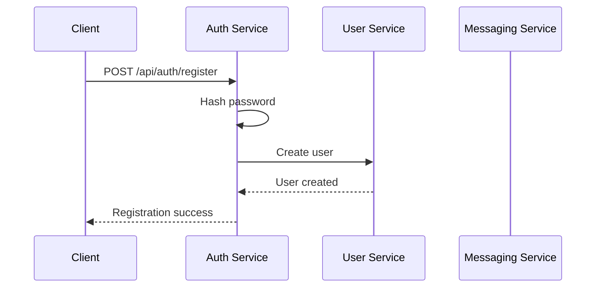
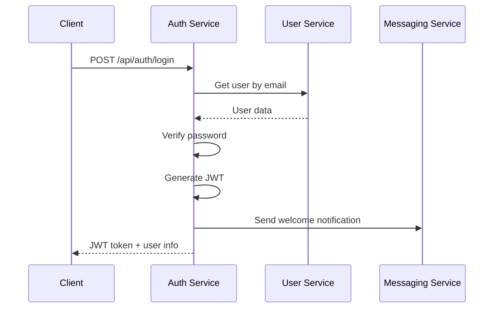
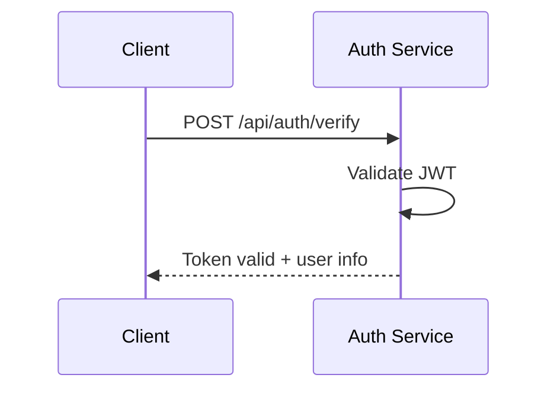

# 🔐 Authentication Service

## Overview

The Authentication Service is the security backbone of the microservices architecture. It handles user authentication, JWT token management, and provides authentication middleware for other services. This service ensures secure access to all protected resources across the system.

## 🏗️ Architecture

```
┌─────────────────┐    ┌─────────────────┐    ┌─────────────────┐
│   Client Apps   │───►│  Auth Service   │───►│  User Service   │
│   (Web/Mobile)  │    │   (Port 3007)   │    │   (Port 3001)   │
└─────────────────┘    └─────────────────┘    └─────────────────┘
         │                       │                       │
         │                       ▼                       │
         │              ┌─────────────────┐              │
         └─────────────►│ Messaging       │◄─────────────┘
                        │ Service         │
                        │ (Port 3006)     │
                        └─────────────────┘
```

## 🚀 Features

### Core Authentication
- **User Registration**: Secure user account creation
- **User Login**: JWT-based authentication
- **Token Management**: JWT generation, validation, and refresh
- **Password Security**: bcrypt hashing with salt rounds
- **Session Management**: Stateless JWT-based sessions

### Advanced Features
- **Welcome Notifications**: Automatic welcome emails on login
- **Messaging Integration**: Sends notifications via messaging service
- **Structured Logging**: Comprehensive authentication logging
- **Health Monitoring**: Service health and status monitoring
- **Graceful Shutdown**: Proper cleanup and connection management

## 📋 API Endpoints

### Public Endpoints
```http
POST /api/auth/register     # User registration
POST /api/auth/login        # User login
GET  /api/health           # Service health check
```

### Protected Endpoints
```http
POST /api/auth/verify       # Token verification
POST /api/auth/refresh      # Token refresh
```

## 🔑 Authentication Flow

### 1. User Registration


### 2. User Login


### 3. Token Verification


## 🛡️ Security Features

### JWT Token Security
- **Secret Key**: Environment variable `JWT_SECRET`
- **Expiration**: Configurable (default: 24 hours)
- **Algorithm**: HS256 (HMAC SHA-256)
- **Payload**: User ID, email, role, name

### Password Security
- **Hashing**: bcrypt with 12 salt rounds
- **Storage**: Only hashed passwords in database
- **Verification**: Secure comparison using bcrypt

### Token Management
- **Generation**: Secure JWT token creation
- **Validation**: Local and remote token verification
- **Refresh**: Token refresh mechanism
- **Expiration**: Automatic token expiration

## 📊 API Examples

### User Registration
```bash
curl -X POST http://localhost:3007/api/auth/register \
  -H "Content-Type: application/json" \
  -d '{
    "name": "John Doe",
    "email": "john@example.com",
    "password": "securepassword123"
  }'
```

Response:
```json
{
  "message": "User registered successfully. Please login to get your access token.",
  "user": {
    "id": 1,
    "email": "john@example.com",
    "name": "John Doe",
    "role": "user"
  }
}
```

### User Login
```bash
curl -X POST http://localhost:3007/api/auth/login \
  -H "Content-Type: application/json" \
  -d '{
    "email": "john@example.com",
    "password": "securepassword123"
  }'
```

Response:
```json
{
  "token": "eyJhbGciOiJIUzI1NiIsInR5cCI6IkpXVCJ9...",
  "user": {
    "id": 1,
    "email": "john@example.com",
    "name": "John Doe",
    "role": "user"
  },
  "expiresIn": "24h"
}
```

### Token Verification
```bash
curl -X POST http://localhost:3007/api/auth/verify \
  -H "Authorization: Bearer <JWT_TOKEN>"
```

Response:
```json
{
  "valid": true,
  "user": {
    "userId": 1,
    "email": "john@example.com",
    "role": "user",
    "name": "John Doe"
  }
}
```

### Token Refresh
```bash
curl -X POST http://localhost:3007/api/auth/refresh \
  -H "Authorization: Bearer <JWT_TOKEN>"
```

Response:
```json
{
  "token": "eyJhbGciOiJIUzI1NiIsInR5cCI6IkpXVCJ9...",
  "expiresIn": "24h"
}
```

## 🔧 Configuration

### Environment Variables
```bash
# JWT Configuration
JWT_SECRET=your-super-secret-jwt-key-change-in-production
JWT_EXPIRES_IN=24h

# Service URLs
USER_SERVICE_URL=http://localhost:3001
MESSAGING_SERVICE_URL=http://localhost:3006

# Service Configuration
PORT=3007
NODE_ENV=development
```

### JWT Configuration
```javascript
const JWT_SECRET = process.env.JWT_SECRET || 'your-super-secret-jwt-key-change-in-production';
const JWT_EXPIRES_IN = process.env.JWT_EXPIRES_IN || '24h';
```

## 🔄 Integration with Other Services

### User Service Integration
- **User Creation**: Creates users via User Service API
- **User Validation**: Validates user credentials with User Service
- **User Data**: Retrieves user information for JWT payload

### Messaging Service Integration
- **Welcome Notifications**: Sends welcome emails on successful login
- **Notification Data**: Includes user context and login information
- **Async Processing**: Non-blocking notification sending

### Middleware Export
The service exports authentication middleware for other services:

```javascript
// Available middleware functions
export const authenticateToken = (req, res, next) => { ... };
export const requireRole = (role) => { ... };
export const requireOwnership = (field) => { ... };
```

## 📝 Logging

### Structured Logging
The service uses the centralized logger for consistent logging:

```javascript
// Authentication success
logger.authSuccess(user.id, email, user.role);

// Authentication failure
logger.authFailed(email, 'Invalid password');

// Service operations
logger.info('Login attempt', { email });
logger.info('Registration attempt');
```

### Log Levels
- **INFO**: Normal operations, login attempts
- **SUCCESS**: Successful authentication
- **WARN**: Authentication failures, invalid credentials
- **ERROR**: System errors, service failures

## 🚀 Getting Started

### 1. Installation
```bash
cd auth-service
npm install
```

### 2. Environment Setup
```bash
# Create .env file
cp .env.example .env
# Edit .env with your configuration
```

### 3. Start the Service
```bash
npm start
```

### 4. Verify Installation
```bash
# Check service health
curl http://localhost:3007/api/health

# Test registration
curl -X POST http://localhost:3007/api/auth/register \
  -H "Content-Type: application/json" \
  -d '{"name":"Test User","email":"test@example.com","password":"password123"}'
```

## 🔍 Health Monitoring

### Health Check Endpoint
```bash
curl http://localhost:3007/api/health
```

Response:
```json
{
  "status": "OK",
  "service": "Authentication Service",
  "timestamp": "2024-01-15T10:30:00.000Z"
}
```

### Service Status
- **Service Health**: Basic service status
- **Dependencies**: User Service and Messaging Service status
- **JWT Configuration**: Token configuration status

## 🛠️ Middleware Usage

### In Other Services
```javascript
import { authenticateToken, requireRole } from '../auth-service/auth-middleware.js';

// Protect routes
app.get('/protected', authenticateToken, (req, res) => {
  // Access req.user for authenticated user info
  res.json({ user: req.user });
});

// Role-based protection
app.get('/admin', authenticateToken, requireRole('admin'), (req, res) => {
  res.json({ message: 'Admin access granted' });
});
```

### Middleware Functions

#### authenticateToken
- Validates JWT tokens
- Adds user info to `req.user`
- Handles token expiration

#### requireRole(role)
- Checks user role permissions
- Admin role has access to everything
- Configurable role requirements

#### requireOwnership(field)
- Ensures users can only access their own resources
- Admin bypass for all resources
- Configurable resource ownership field

## 🔐 Security Best Practices

### JWT Security
- **Strong Secrets**: Use cryptographically strong JWT secrets
- **Token Expiration**: Implement reasonable token expiration
- **Secure Storage**: Store tokens securely on client side
- **HTTPS Only**: Use HTTPS in production

### Password Security
- **Strong Hashing**: Use bcrypt with sufficient salt rounds
- **Password Policies**: Implement password complexity requirements
- **Secure Transmission**: Use HTTPS for password transmission

### General Security
- **Input Validation**: Validate all input data
- **Error Handling**: Don't expose sensitive information in errors
- **Rate Limiting**: Implement rate limiting for auth endpoints
- **Monitoring**: Monitor authentication attempts and failures

## 🚨 Error Handling

### Authentication Errors
- **400 Bad Request**: Missing required fields
- **401 Unauthorized**: Invalid credentials
- **409 Conflict**: User already exists
- **500 Internal Server Error**: System errors

### Error Responses
```json
{
  "error": "Invalid credentials",
  "message": "Email or password is incorrect"
}
```

## 📚 Dependencies

### Core Dependencies
- **express**: Web framework
- **jsonwebtoken**: JWT token management
- **bcryptjs**: Password hashing
- **axios**: HTTP client for service communication
- **cors**: Cross-origin resource sharing
- **dotenv**: Environment variable management

### Logger Integration
- **../logger-service/logger.js**: Centralized logging

## 🔧 Customization

### Adding New Authentication Methods
```javascript
// Add OAuth integration
app.post('/api/auth/oauth', async (req, res) => {
  // OAuth implementation
});
```

### Custom Token Payload
```javascript
const token = jwt.sign(
  { 
    userId: user.id, 
    email: user.email, 
    role: user.role || 'user',
    name: user.name,
    customField: 'customValue'  // Add custom fields
  },
  JWT_SECRET,
  { expiresIn: JWT_EXPIRES_IN }
);
```

## 🚨 Production Considerations

### Security
- **Strong JWT Secrets**: Use environment-specific secrets
- **HTTPS**: Enable SSL/TLS encryption
- **Token Blacklisting**: Implement token revocation
- **Rate Limiting**: Protect against brute force attacks

### Performance
- **Token Caching**: Cache validated tokens
- **Connection Pooling**: Optimize database connections
- **Load Balancing**: Use multiple auth service instances

### Monitoring
- **Authentication Metrics**: Track login success/failure rates
- **Token Usage**: Monitor token generation and validation
- **Security Alerts**: Alert on suspicious authentication patterns

---

**The Authentication Service is the security foundation of your microservices architecture, ensuring secure access to all protected resources!** 🔐
