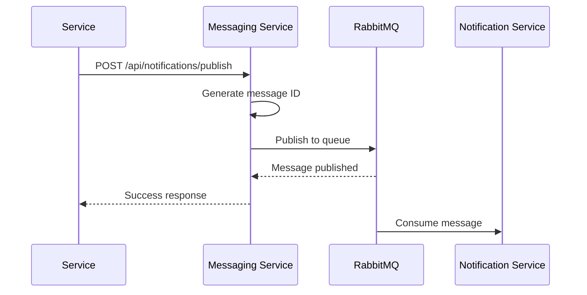
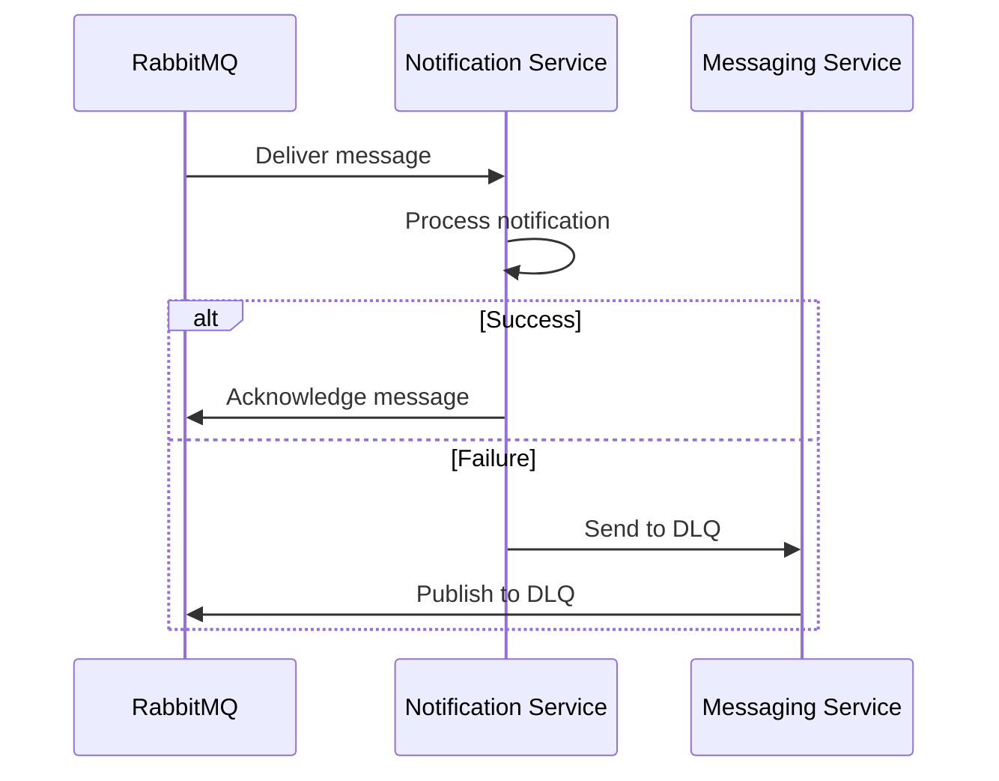

# 📨 Messaging Service

## Overview

The Messaging Service acts as the central message broker in the microservices architecture. It manages RabbitMQ operations, provides HTTP APIs for message publishing, and handles queue management with advanced features like idempotency, dead letter queues, and retry mechanisms. This service enables asynchronous communication between microservices.

## 🏗️ Architecture

```
┌─────────────────┐    HTTP     ┌──────────────────┐    RabbitMQ    ┌──────────────────┐
│   User Service  │ ──────────→ │ Messaging Service│ ──────────────→ │ Notification     │
│   (Port 3001)   │             │   (Port 3006)    │                 │ Service         │
└─────────────────┘             └──────────────────┘                 │ (Port 3003)     │
                                                                      └──────────────────┘
┌─────────────────┐    HTTP     ┌──────────────────┐
│  Todo Service   │ ──────────→ │ Messaging Service│
│   (Port 3002)   │             │   (Port 3006)    │
└─────────────────┘             └──────────────────┘
```

## 🚀 Features

### Core Messaging
- **Message Publishing**: HTTP API for publishing messages to queues
- **Queue Management**: Automatic queue creation and management
- **Idempotency**: Prevents duplicate message processing
- **Dead Letter Queue**: Handles failed messages
- **Retry Mechanism**: Exponential backoff with jitter

### Advanced Features
- **Message Persistence**: Durable message storage
- **Queue Monitoring**: Real-time queue status and metrics
- **Health Monitoring**: Service and RabbitMQ health checks
- **Structured Logging**: Comprehensive messaging operation logging
- **Graceful Shutdown**: Proper cleanup and connection management

## 📋 API Endpoints

### Message Publishing
```http
POST /api/messages/publish        # Publish message to any queue
POST /api/notifications/publish   # Publish notification (convenience)
```

### Monitoring & Management
```http
GET  /api/health                 # Service health check
GET  /api/queue/status          # Queue status and metrics
GET  /api/dlq/messages          # Dead letter queue information
GET  /api/queues                # List all available queues
```

## 🔑 Message Flow

### 1. Message Publishing


### 2. Message Processing


## 🛡️ Security Features

### Message Security
- **Message Validation**: Validates message structure and content
- **Queue Isolation**: Messages are isolated by queue
- **Access Control**: HTTP-based access control
- **Message Integrity**: Ensures message integrity during transmission

### Operational Security
- **Connection Security**: Secure RabbitMQ connections
- **Error Handling**: Secure error message handling
- **Logging**: Comprehensive operation logging
- **Monitoring**: Real-time monitoring and alerting

## 📊 API Examples

### Publish Message
```bash
curl -X POST http://localhost:3006/api/messages/publish \
  -H "Content-Type: application/json" \
  -d '{
    "queue": "notification_queue",
    "data": {
      "type": "welcome",
      "recipient": "user@example.com",
      "subject": "Welcome!",
      "content": {
        "name": "John Doe",
        "message": "Welcome to our platform!"
      }
    }
  }'
```

Response:
```json
{
  "message": "Message published successfully",
  "queue": "notification_queue",
  "messageId": "a1b2c3d4e5f6g7h8i9j0k1l2m3n4o5p6q7r8s9t0",
  "timestamp": "2024-01-15T10:30:00.000Z"
}
```

### Publish Notification (Convenience)
```bash
curl -X POST http://localhost:3006/api/notifications/publish \
  -H "Content-Type: application/json" \
  -d '{
    "type": "welcome",
    "recipient": "user@example.com",
    "subject": "Welcome to Our Platform!",
    "content": {
      "name": "John Doe",
      "message": "Thank you for joining our platform!"
    },
    "template": "welcome",
    "userId": 123,
    "operation": "user_created"
  }'
```

Response:
```json
{
  "message": "Notification published successfully",
  "type": "welcome",
  "recipient": "user@example.com",
  "messageId": "a1b2c3d4e5f6g7h8i9j0k1l2m3n4o5p6q7r8s9t0",
  "timestamp": "2024-01-15T10:30:00.000Z"
}
```

### Health Check
```bash
curl http://localhost:3006/api/health
```

Response:
```json
{
  "status": "healthy",
  "service": "messaging-service",
  "rabbitmq": "connected",
  "queues": {
    "main": {
      "name": "notification_queue",
      "messageCount": 5,
      "consumerCount": 1
    },
    "dlq": {
      "name": "notification_dlq",
      "messageCount": 0,
      "consumerCount": 0
    }
  },
  "timestamp": "2024-01-15T10:30:00.000Z"
}
```

### Queue Status
```bash
curl http://localhost:3006/api/queue/status
```

Response:
```json
{
  "status": "connected",
  "queues": {
    "main": {
      "name": "notification_queue",
      "messageCount": 5,
      "consumerCount": 1
    },
    "dlq": {
      "name": "notification_dlq",
      "messageCount": 0,
      "consumerCount": 0
    }
  },
  "connection": "active",
  "url": "amqp://localhost"
}
```

## 🔧 Configuration

### Environment Variables
```bash
# RabbitMQ Configuration
RABBITMQ_URL=amqp://localhost
MESSAGING_SERVICE_PORT=3006

# Service Configuration
NODE_ENV=development
```

### RabbitMQ Configuration
```javascript
const RABBITMQ_URL = process.env.RABBITMQ_URL || 'amqp://localhost';
const QUEUE_NAME = 'notification_queue';
const DLQ_NAME = 'notification_dlq';
```

## 🗄️ Queue Configuration

### Main Queue
```javascript
await channel.assertQueue(QUEUE_NAME, {
  durable: true
});
```

### Dead Letter Queue
```javascript
await channel.assertQueue(DLQ_NAME, {
  durable: true
});
```

### Message Properties
```javascript
const message = JSON.stringify(messageData);
const success = channel.sendToQueue(queueName, Buffer.from(message), {
  persistent: true,
  messageId: messageId,
  headers: {
    retryCount: 0,
    originalTimestamp: new Date().toISOString(),
    messageId: messageId
  }
});
```

## 🔄 Integration with Other Services

### User Service Integration
- **Welcome Notifications**: Sends welcome emails on user creation
- **User Operations**: Notifications for user-related operations
- **HTTP API**: Simple HTTP-based message publishing

### Todo Service Integration
- **Todo Notifications**: Sends notifications for todo operations
- **Todo Operations**: Creation, update, and deletion notifications
- **HTTP API**: Simple HTTP-based message publishing

### Notification Service Integration
- **Message Consumption**: Consumes messages from queues
- **Email Processing**: Processes email notifications
- **Error Handling**: Handles failed message processing

## 📝 Logging

### Structured Logging
The service uses the centralized logger for consistent logging:

```javascript
// Message operations
logger.messagePublished(messageId, queueName, messageData.type, messageData.recipient);
logger.queueConnected(`${QUEUE_NAME}, ${DLQ_NAME}`);
logger.queueError(error, `${QUEUE_NAME}, ${DLQ_NAME}`);

// API operations
logger.apiRequest('POST', '/api/notifications/publish', 200, duration);

// Error logging
logger.error('Message publishing failed', {
  queue: queueName,
  error: error.message,
  type: messageData?.type
});
```

### Log Levels
- **INFO**: Normal operations, message publishing
- **SUCCESS**: Successful message operations
- **WARN**: Queue warnings, connection issues
- **ERROR**: System errors, publishing failures

## 🚀 Getting Started

### 1. Installation
```bash
cd messaging-service
npm install
```

### 2. RabbitMQ Setup
```bash
# Using Docker (Recommended)
docker run -d --name rabbitmq \
  -p 5672:5672 \
  -p 15672:15672 \
  rabbitmq:3-management

# Or install locally
# Follow RabbitMQ installation guide for your OS
```

### 3. Environment Setup
```bash
# Create .env file
cp .env.example .env
# Edit .env with your RabbitMQ configuration
```

### 4. Start the Service
```bash
npm start
```

### 5. Verify Installation
```bash
# Check service health
curl http://localhost:3006/api/health

# Test message publishing
curl -X POST http://localhost:3006/api/notifications/publish \
  -H "Content-Type: application/json" \
  -d '{"type":"test","recipient":"test@example.com","subject":"Test"}'
```

## 🔍 Health Monitoring

### Health Check Endpoint
```bash
curl http://localhost:3006/api/health
```

Response:
```json
{
  "status": "healthy",
  "service": "messaging-service",
  "rabbitmq": "connected",
  "queues": {
    "main": {
      "name": "notification_queue",
      "messageCount": 0,
      "consumerCount": 1
    },
    "dlq": {
      "name": "notification_dlq",
      "messageCount": 0,
      "consumerCount": 0
    }
  },
  "timestamp": "2024-01-15T10:30:00.000Z"
}
```

### Health Status
- **Service Status**: Overall service health
- **RabbitMQ Status**: RabbitMQ connection status
- **Queue Status**: Queue health and metrics
- **Message Count**: Current message counts

## 🛠️ Message Publishing

### Basic Message Publishing
```javascript
const publishMessage = async (queueName, messageData) => {
  try {
    if (!channel) {
      throw new Error('RabbitMQ channel not available');
    }
    
    // Generate unique message ID for idempotency
    const messageId = generateMessageId(messageData);
    const message = JSON.stringify(messageData);
    
    const success = channel.sendToQueue(queueName, Buffer.from(message), {
      persistent: true,
      messageId: messageId,
      headers: {
        retryCount: 0,
        originalTimestamp: new Date().toISOString(),
        messageId: messageId
      }
    });
    
    if (success) {
      logger.messagePublished(messageId, queueName, messageData.type, messageData.recipient);
      return { success: true, messageId };
    } else {
      throw new Error('Failed to publish message to queue');
    }
  } catch (error) {
    logger.error('Message publishing failed', {
      queue: queueName,
      error: error.message,
      type: messageData?.type
    });
    throw error;
  }
};
```

### Idempotency
```javascript
const generateMessageId = (messageData) => {
  const content = JSON.stringify(messageData);
  return crypto.createHash('sha256').update(content).digest('hex');
};
```

## 🔐 Security Best Practices

### Message Security
- **Message Validation**: Validate message structure and content
- **Queue Isolation**: Messages are isolated by queue
- **Access Control**: HTTP-based access control
- **Message Integrity**: Ensure message integrity

### Operational Security
- **Connection Security**: Secure RabbitMQ connections
- **Error Handling**: Secure error message handling
- **Logging**: Comprehensive operation logging
- **Monitoring**: Real-time monitoring and alerting

## 🚨 Error Handling

### Message Errors
- **400 Bad Request**: Missing required fields
- **500 Internal Server Error**: Publishing failures
- **503 Service Unavailable**: RabbitMQ unavailable

### Error Responses
```json
{
  "error": "Queue name and data are required"
}
```

## 📚 Dependencies

### Core Dependencies
- **express**: Web framework
- **amqplib**: RabbitMQ client
- **crypto**: Message ID generation
- **cors**: Cross-origin resource sharing
- **dotenv**: Environment variable management

### Logger Integration
- **../logger-service/logger.js**: Centralized logging

## 🔧 Customization

### Adding New Queues
```javascript
// Add new queue
const NEW_QUEUE_NAME = 'new_queue';

await channel.assertQueue(NEW_QUEUE_NAME, {
  durable: true
});
```

### Custom Message Types
```javascript
// Add custom message processing
const processCustomMessage = async (messageData) => {
  switch (messageData.type) {
    case 'custom_type':
      // Custom processing logic
      break;
    default:
      // Default processing
  }
};
```

## 🚨 Production Considerations

### RabbitMQ
- **Clustering**: Implement RabbitMQ clustering
- **Persistence**: Enable message persistence
- **Monitoring**: Monitor RabbitMQ performance
- **Backup**: Implement queue backup strategies

### Security
- **HTTPS**: Enable SSL/TLS encryption
- **Authentication**: Implement RabbitMQ authentication
- **Network Security**: Secure network connections
- **Access Control**: Implement proper access controls

### Performance
- **Connection Pooling**: Optimize RabbitMQ connections
- **Load Balancing**: Use multiple messaging service instances
- **Queue Optimization**: Optimize queue configurations
- **Monitoring**: Monitor service performance

---

**The Messaging Service is the communication backbone of your microservices architecture, enabling reliable asynchronous communication between services!** 📨
